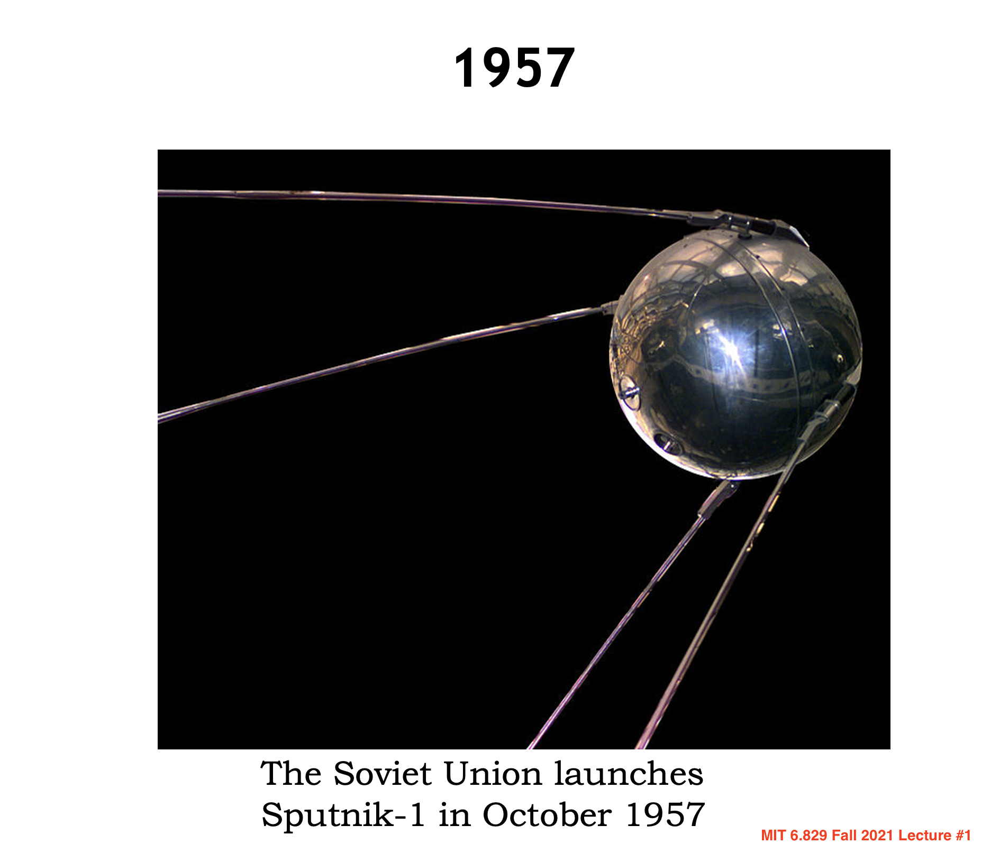
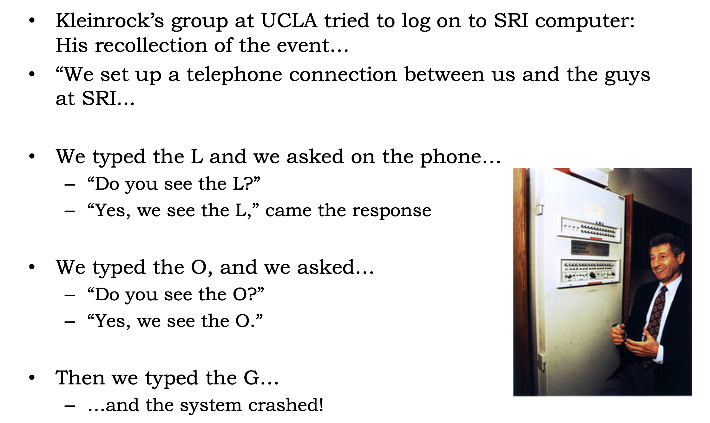
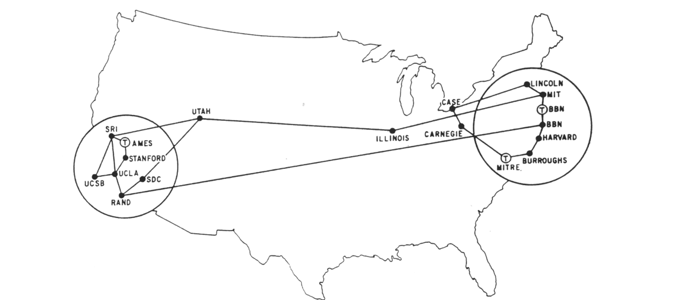
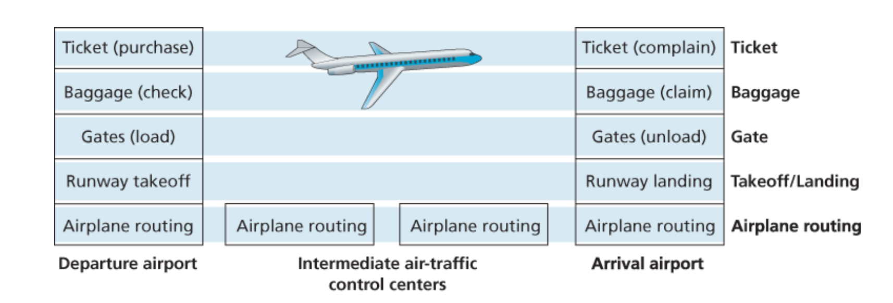
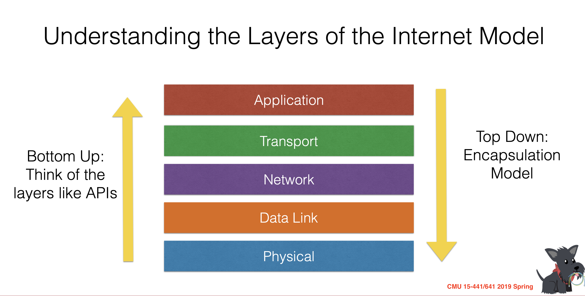
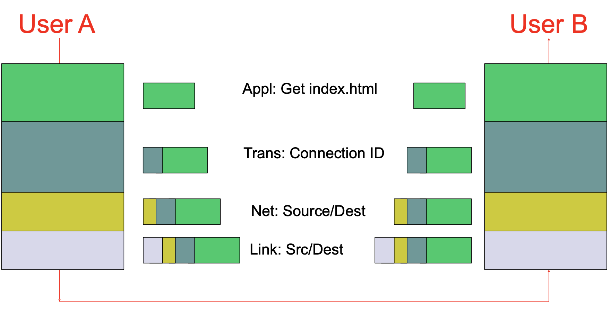

### Computer Network Notes by Angold Wang

# 1. Introduction to Computer Network

## 1. Internet Architecture Via the Lens of History

### i. The Development of Packet Switching: 1961-1972

In 1957, the Soviet Union launches Sputnik-1, which led to the creation of **ARPA** (Advanced Research Projects Agency). 

At the same time, Three Research groups around the world, each unaware of the others' work, began inventing packet switching as an effcient and robust alternative to circuit switching.

* The first published work on packet-switching techniques was that of **[Leonard Kleinrock](https://en.wikipedia.org/wiki/Leonard_Kleinrock)**, who is a graduate student at MIT. 
* In early 1960, **[Donald Davies](https://en.wikipedia.org/wiki/Donald_Davies)** were also developing their ideas on packet switching at the National Physical Laboratory(NPL) in England.
* In 1964, **[Paul Baran](https://en.wikipedia.org/wiki/Paul_Baran)** at RAND Corp had begun invesgating the use of packet switching for secure voice over military networks during the Cold War.

**[Packet Switching](https://en.wikipedia.org/wiki/Packet_switching)** is a method of grouping data into packets that are transmitted over a digital network. (Wikipedia). 

Packets are made of a **header** and a **payload**. 
* Data in the **header** is used by networking hardware to direct the packet to its destination.
* The **payload** is extracted and used by an operating system, application software or higher layer protocols.

**The work at MIT, RAND and the NPL laid the foundations for today's Internet.** 

Back to the 1960s, after graduate from MIT, Leonard Kleinrock went to UCLA and led a research group there. And his colleagues at MIT: **[J.C.R Licklider](https://en.wikipedia.org/wiki/J._C._R._Licklider)** and **[Lawrence Roberts](https://en.wikipedia.org/wiki/Lawrence_Roberts)** went on to lead the computer science program at the **Advanced Research Projects Agency (ARPA)** in the United States. Where roberts published an overall plan for the **ARPAnet**, the first packet-switched computer
network and a direct ancestor of today's public Internet.

On Labor Day in 1969, the first packet switch was installed at **UCLA** under **Kleinrock**'s supervision, after that, there are three additional packet switches installed shortly thereafter at the **Stanford Research Institute(SRI)**, **UC Santa Barbara**, and **the University of Utah**.

By 1972, **ARPANET** had grown to approximately 15 nodes. The firsty host-to-host protocol between **ARPANET** end systems, known as the **network-control portocol(NCP)** was completed. And the first two cross-country lines (BBN-UCLA and MIT-Utah) was estanblished.

## 2. The Internet Model & Layering

### i. Intro: An Airline System
As you might think, it is apparent that the Internet is an extremely complicated system, is there any hope of organizing a network architecture, or at least our discussion of network architecture?

Fortunately, the answer to both questions is yes, and actually, we deal with complex systems all the time in our everyday life. For example, the airline system, how would you find the structure of to describe the series of actions you take, and all the stuff in this system such as ticketing agents, baggage checkers, gate personnel,. etc. 

Usually, people would use multiple sequential **actions** to describe this system.

* Purchase ticket -> Check baggage -> Load gates -> Takeoff -> Airplane routine
* Airplane routine -> Landing -> Unload gates -> Claim baggage -> Complain ticket

Maybe most of them do not aware of it: when they describe these actions, they divide the airline functionality into layers.

Each layer provides its **service** by:
1. **Performing certain actions within that layer.**
 * At the gate layer, loading and unloading people from an airplane.
2. **Using the services of the layer directly below it.**
 * The gate (unload) requires the airplane takeoff and routing to the destination.

### ii. Protocols

Let's turn our attention to network **protocols**, for example, the services provided by layer n may include reliable delivery of messages from one edge of the network to the other, and this might be implemented by using an unreliable edge-to-edge message delivery service of layer n-1, and adding layer n functionality to detect and retransmit lost messages.

In my opinion, most of the computer networks are all about **protocols**
* Network designers organize **protocols**
* Network hardware and software implement the **protocols**
* Each **protocol** belongs to one of the layers.

**Protocol layering** has conceptual and structural advantages. As we have seen, layering provides a structured way to discuss system components. Modularity makes it easier to update system components.

### iii. Five-layer Internet Protocol Stack
**A layered achitecture allow us to discuss a well-defined, specific part of a large and complex system.**

