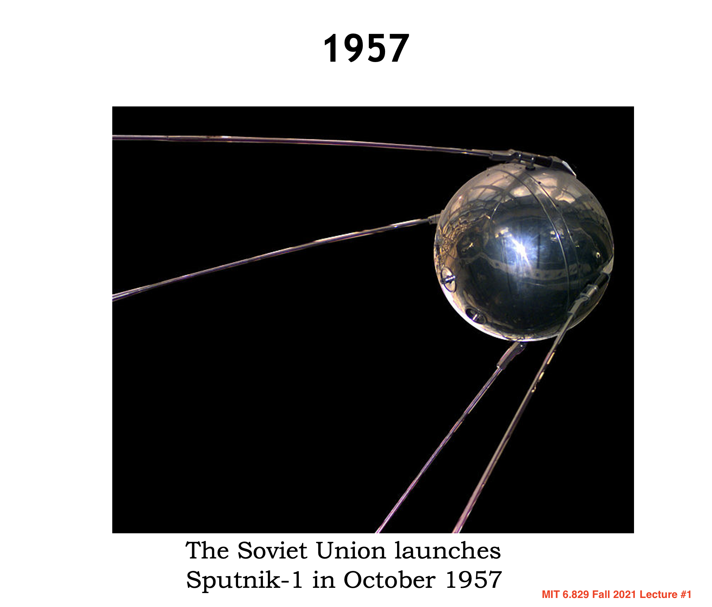
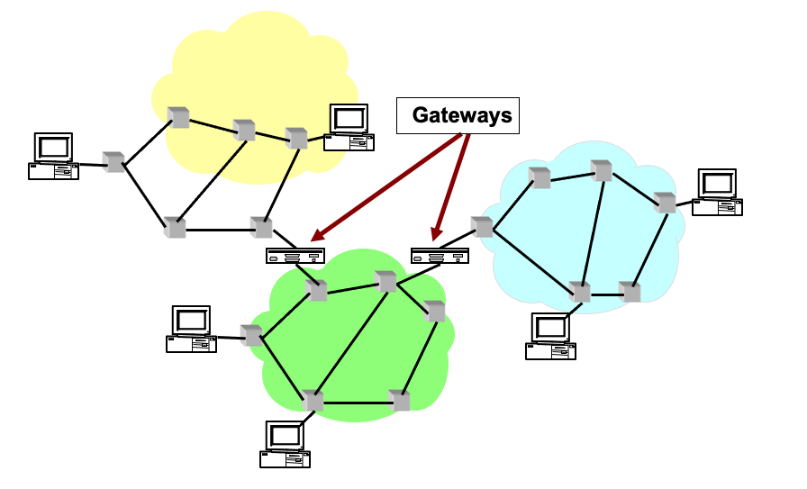
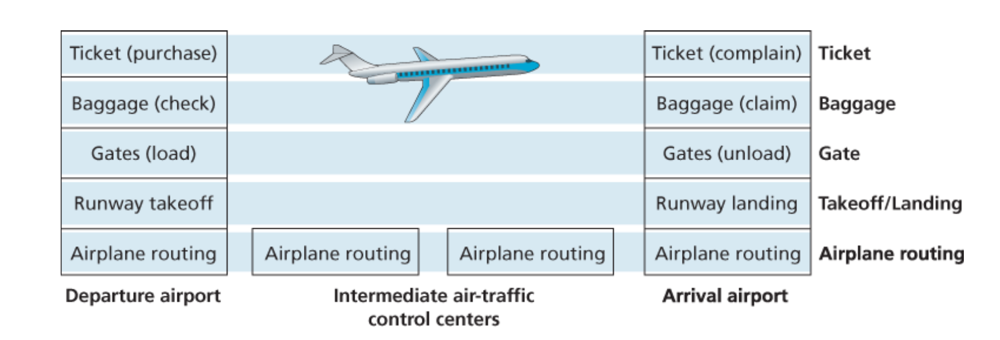
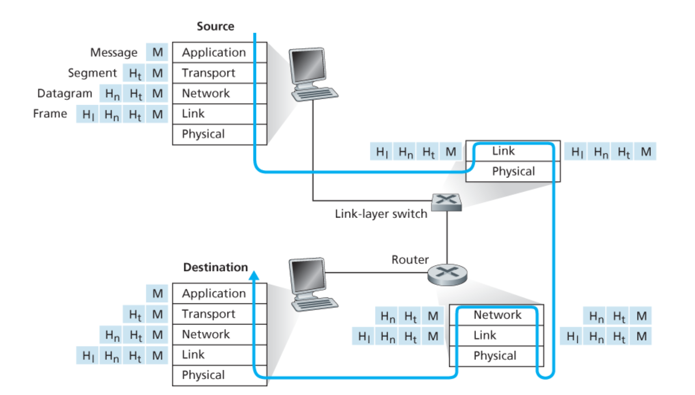

### Computer Network Notes by Angold Wang

# 1. Introduction to Computer Network

## 1. Internet Architecture Via the Lens of History

**One should architect systems for flexibility – you’ll almost never know what apps make it succeed.**

(Even if it means sacrificing some performance!)

### i. The Development of Packet Switching: 1961-1972

In 1957, the Soviet Union launches Sputnik-1, which led to the creation of **ARPA** (Advanced Research Projects Agency). 

At the same time, Three Research groups around the world, each unaware of the others' work, began inventing packet switching as an effcient and robust alternative to circuit switching.

* The first published work on packet-switching techniques was that of **[Leonard Kleinrock](https://en.wikipedia.org/wiki/Leonard_Kleinrock)**, who is a graduate student at MIT. 
* In early 1960, **[Donald Davies](https://en.wikipedia.org/wiki/Donald_Davies)** were also developing their ideas on packet switching at the National Physical Laboratory(NPL) in England.
* In 1964, **[Paul Baran](https://en.wikipedia.org/wiki/Paul_Baran)** at RAND Corp had begun invesgating the use of packet switching for secure voice over military networks during the Cold War.

**[Packet Switching](https://en.wikipedia.org/wiki/Packet_switching)** is a method of grouping data into packets that are transmitted over a digital network. (Wikipedia). 

Packets are made of a **header** and a **payload**. 
* Data in the **header** is used by networking hardware to direct the packet to its destination.
* The **payload** is extracted and used by an operating system, application software or higher layer protocols.

**The work at MIT, RAND and the NPL laid the foundations for today's Internet.** 

Back to the 1960s, after graduate from MIT, Leonard Kleinrock went to UCLA and led a research group there. And his colleagues at MIT: **[J.C.R Licklider](https://en.wikipedia.org/wiki/J._C._R._Licklider)** and **[Lawrence Roberts](https://en.wikipedia.org/wiki/Lawrence_Roberts)** went on to lead the computer science program at the **Advanced Research Projects Agency (ARPA)** in the United States. Where roberts published an overall plan for the **ARPAnet**, the first packet-switched computer
network and a direct ancestor of today's public Internet.

On Labor Day in 1969, the first packet switch was installed at **UCLA** under **Kleinrock**'s supervision, after that, there are three additional packet switches installed shortly thereafter at the **Stanford Research Institute(SRI)**, **UC Santa Barbara**, and **the University of Utah**.

By 1972, **ARPANET** had grown to approximately 15 nodes. The firsty host-to-host protocol between **ARPANET** end systems, known as the **network-control portocol(NCP)** was completed. And the first two cross-country lines (BBN-UCLA and MIT-Utah) was estanblished.

### ii. Proprietary Networks and Internetworking: 1972-1980

In 1972, after the successful **ARPANET** demo at conference, people in the nodes can use modified ARPANET email program to communicate with each other (using **NCP**).

In the early to mid-1970s, additional stand-alone packet switching networks besides ARPAnet came into being: 
* **ALOHANET**: a micro-wave network linking universities on the Hawaiian islands. 
* **DARPA** (Defense Advanced Research Projects Aganecy) 's packet-satellite and packet-ratio networks. 
* **Telent:** a BBN commercial packet-switching network based on ARPAnet technology.
* **Cyclades:** a french packet-switching network pioneered by **[Louis Pouzin](https://en.wikipedia.org/wiki/Louis_Pouzin)**.
    * **CYCLADES** brings many good ideas: 
    * **best-effort "datagrams"**; **sliding window protocol**; **distance-vector routing**; **time-sync**...

The number of packet-switching networks was growing, as they belong to different adminstrations, at that time, only nodes on the same network could communicate.

Pioneering work on **"Internetworking"**, or **Network of Networks**, or word **Internet** (under the sponsership of **DARPA**), was done by **[Vinton Cerf](https://en.wikipedia.org/wiki/Vint_Cerf)** and **[Robert Kahn](https://en.wikipedia.org/wiki/Bob_Kahn)**.

Their first work is **TCP** (Transimission control protocol), the early versions of TCP, however, were quite different from today's TCP. **The early versions of TCP combined a reliable in-sequence delivery of data via end-system retransmission** (still part of today's TCP) **with forwarding functions** (which today are performed by IP).

They use **Boxes** (then called **gateways**) to connect networks. As the TCP is quite slow at that time (reliable), the requirement of fast, unreliable protocol becomes significant, which lead to the separation of IP out of TCP (reusable, modular) and the development of the **UDP** (User Datagram Protocol).

**The three key Internet protocols that we see today -- TCP, UDP, and IP -- were conceptually in place by the end of 1970s.** In retrospect: **Packet switching (with TCP/IP) won because it is good enough for almost every application** (though optimal for nothing!).

### iii. Rapid Growth: 1980-1990

By the end of 1970s, approximately two hundred hosts were connected to the ARPANET. By the end of 1980s the number of hosts connected to the public Internet would reach a hundred thousand. The 1980s would be a time of tremendous growth.

Much of that growth resulted from several distinct efforts to create computer networks linking universities together.

* **January 1, 1983** saw the official deployment of TCP/IP as the new standard host protocol for ARPANET** (replacing the NCP), which is a flag day event -- **all host were required to transfer over to TCP/IP as of that day**.

* **In 1984**, The **DNS** (Domain Name SYstem) Introduced, which used to map between a human-readable Internet name, and its 32-bit IP address, was also developed.

* **In the late 1980s**, important extensions were made to TCP to implement host-based **congestion control**.

### iv. The Internet Explosion: The 1990s

The main event of the 1990s was to be the emergence of the **World Wide Web** application, which **brought the Internet into the homes and businesses of millions of people worldwide**. The Web served as a platform for enabling and deploying hundreds of new **applications** that we take for granted today, including **search** (e.g., *Google* and *Bing*) **Internet commerce** (e.g., *Amazon* and *eBay*) and **social networks** (e.g., *Facebook*).

The **WWW** was invented by **[Tim Berners-Lee](https://en.wikipedia.org/wiki/Tim_Berners-Lee)** between 1989 and 1991. Berners-Lee and his associates developed initial versions of **HTML**, **HTTP**, a **Web server** and a **Browser** -- the four key components of the Web.

The second half of the 1990s was a period of tremendous growth and innovation for the Internet, with major corporations and thousands of startups creating Internet products and services. By the end of the millennium the Internet was supporting hundreds of popular applications, including four killer applications:

* **E-mail, including attachments and Web-accessible e-mail** 
* **The Web, including Web browsing and Internet commerce** 
* **Instant messaging, with contact lists**
* **Peer-to-peer file sharing of MP3s, pioneered by Napster**

The period from 1995 to 2001 was a roller-coaster ride for the Internet in the financial markets. Before they were even profitable, hundreds of Internet startups made initial public offerings and started to be traded in a stock market. Many companies were valued in the billions of dollars without having any significant revenue streams. The Internet stocks collapsed in 2000–2001, and many startups shut down. Nevertheless, a number of companies emerged as big winners in the Internet space, including *Microsoft*, *Cisco*, *Yahoo*, *e-Bay*, *Google*, and *Amazon*.

As the commercialization of Internet arrive. **ARPANET**, the progenitor of the Internet, ceased to exist, with Internet backbone traffic being carried by commercial Internet Service Providers.

## 2. The Internet Model & Layering

### i. Intro: An Airline System
As you might think, it is apparent that the Internet is an extremely complicated system, is there any hope of organizing a network architecture, or at least our discussion of network architecture?

Fortunately, the answer to both questions is yes, and actually, we deal with complex systems all the time in our everyday life. For example, the airline system, how would you find the structure of to describe the series of actions you take, and all the stuff in this system such as ticketing agents, baggage checkers, gate personnel,. etc. 

Usually, people would use multiple sequential **actions** to describe this system.

* Purchase ticket -> Check baggage -> Load gates -> Takeoff -> Airplane routine
* Airplane routine -> Landing -> Unload gates -> Claim baggage -> Complain ticket

Maybe most of them do not aware of it: when they describe these actions, they divide the airline functionality into layers.

Each layer provides its **service** by:
1. **Performing certain actions within that layer.**
 * At the gate layer, loading and unloading people from an airplane.
2. **Using the services of the layer directly below it.**
 * The gate (unload) requires the airplane takeoff and routing to the destination.

### ii. Protocols

Let's turn our attention to network **protocols**, for example, the services provided by layer n may include reliable delivery of messages from one edge of the network to the other, and this might be implemented by using an unreliable edge-to-edge message delivery service of layer n-1, and adding layer n functionality to detect and retransmit lost messages.

In my opinion, most of the computer networks are all about **protocols**
* Network designers organize **protocols**
* Network hardware and software implement the **protocols**
* Each **protocol** belongs to one of the layers.

**Protocol layering** has conceptual and structural advantages. As we have seen, layering provides a structured way to discuss system components. Modularity makes it easier to update system components.

### iii. Five-layer Internet Protocol Stack
> **“Modularity based on abstraction is the way things get done.”** -- Barbara Liskov

**A layered achitecture allow us to discuss a well-defined, specific part of a large and complex system.**

Here is **The Five-layer Internet Protocol Stack**, which is widely used in practice today. In the following articles, we'll take a **top-down approach**. first covering the application layer and then proceeding downward. **But lets take a bottom-up approach first in order to give a first glance of it.**

#### Physical Layer
“The physical layer defines the means of transmitting raw bits... The bitstream may be grouped into code words or symbols and converted to a physical signal that is transmitted over a transmission medium." [Wikipedia]

**Using any physical medium (electricity, light, radio waves ...) to provides an API (1's and 0's) to the "next up" layer.**

Anyone using the Physical layer can just think about 1's and 0's -- they don't have to worry about how the data is transmitted.

#### Data Link Layer

The data link layer allows everyone in the same link (routers...) to talk to everyone else.

The Ethernet protocol, Bluetooth protocol... are all the example of data link-layer protocol.

* **Turns those 1's and 0's into packets.**
* **Labels senders and receivers.**
* **Prevents multiple senders from transmitting at the same time.**
    * Think about wireless: if two transmitters transmit at the same time, they interfere with each other and the signal doesn't get through.

The layer above just see nice, uncorrupted packets, and data link layer will trasmit the packet into the target in the same link.

#### Network Layer

The network layer just stick another header inside of your packets, which will contain global addresses: the **IP Addresses**.

* **Switches look at the Layer-2 Header and route according to the Layer-2 Address** (e.g, MAC addresses)
* **Routers strip off the Layer-2 Header and look at the Layer 3 Header. They route using Layer 3** (i.e. IP) **addresses.**

**The network layer then provides the service of delivering the segment to the transport layer in the destination host.**

#### Transport Layer

The IP layer doesn't give any guarentee!! Since packets can arrive out of order, or they can be lost. **The transport layer wants to makes up for this, which is implemented in code running in end hosts.**
* **It can establish a connection between two end points.**
* **It can re-transmit data that is lost.**
* **It can put packets back together in the right order.**

* **TCP**: Reliable In-Order Byte Stream
* **UDP**: No guarantees

#### Application Layer

The application layer is where network applications and their application-layer protocols reside. The Internet’s application layer includes many protocols, such as the **HTTP protocol** (which provides for Web document request and transfer), **SMTP** (which provides for the transfer of e-mail messages), and **FTP** (which provides for the transfer of files between two end systems).

## 3. Encapsulation

If you take a Top-Down view of the Five-Layer Internet Protocol, you may discover (if not, try to understand) an very important concept of **encapsulation**. Just as the airline example we saw before, let's try to understand the Internet through some actions:

1. **The Application sends a chunk of data (bytestream) down to transport layer.**
2. **Transport layer chops the data into pieces, adds a connection ID & header.**
3. **Transport layer hands down to IP layer where packet gets an IP address.**
4. **Packet goes down to link layer where packets gets, e.g,. an Ethernet header.**
5. **Whenever this Frame pass-by a switch, the link-layer switch will look at the Layer-2 header, and decide where to go next.**
6. **Whenever this Frame pass-by a router, the router will strip off the Layer-2 header and look at the Layer 3 header to guide the routher to reach the destination.**
7. **When this Frame arrive at the destination host, the host will strip off layer 2 and 3 headers, then strip off the transport header, potentially put packets back in order.**
8. **After that, the application finally reads the data that was sent.**

The following figure illustrates the control flow and physical path of Encapsulation in Internet:

As we can see in the figure: **link-layer switches only implement layers 1 and 2**; **routers implement layers 1 through 3.** **And the host implement all five layers.**

This means, for example, that Internet routers are capable of implementing the IP protocol (a layer 3 protocol), while link-layer switches are not.

Now let's try to understand the word: **"Encapsulation"**:

* At the sending host, an application-layer message (**M** in Figure above) is passed to the transport layer. In the simplest case, **the transport layer takes the message and appends additional information (so-called transport-layer header information, Ht in Figure above) that will be used by the receiver-side transport layer.** 

* Then The application-layer message and the transport-layer header information together constitute the transport layer segment. **The transport-layer segment thus encapsulates the application-layer message. The added information might include information allowing the receiver-side transport layer to deliver the message up to the appropriate application, and error-detection bits that allow the receiver to determine whether bits in the message have been changed in route.** 

* The transport layer then passes the segment to the network layer, **which adds network-layer header information (Hn in Figure above) such as source and destination end system addresses**, creating a network-layer **datagram**. 

* The datagram is then passed to the link layer, which (of course!) will add its own link-layer header information and create a link-layer frame. Thus, we see that at each layer, a packet has two types of fields: **header** fields and a **payload** field. The payload is typically a packet from the layer above.

**this page was last edited on 17 July 2022, at 11:45 (UTC), by [Angold Wang](https://github.com/Angold-4).**

