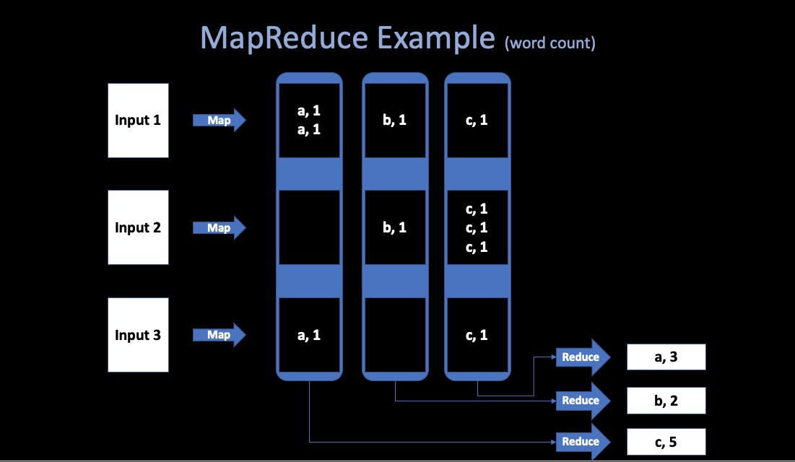

# 1. Introduction
##### 02/07/2022 By Angold Wang

## 1. Distributed System
### What a Distributed System is?
**A set of cooperating computers that are communicating with each other over network to get some coherent task done.**

#### Examples
* Storiage for big websites
* Big data computations (MapReduce)
* ...

> if you are designing a system, like you need to solve some problem **if you can possibly solve it on a single computer without building a distributed system, you should do it that way**. And there are many many jobs you can get done on a single computer and it's always easier. (distributed system are not simpler)

### Why People Need a Distributed System?

Usually, the high-level goal of building a distributed system is to get what people call **scalable speed-up**.

1. **Parallelism**
2. **Fault tolerate**
3. Physical reason
4. Security / isolated

#### Challenges
* **Concurrency**
* Partial failure
* Performance


### To Build such Abstractions...

> The applications are going to use the **infrastructure** that we're thinking about in this course.

* **Storage**
* Communication
* **Computation**

> Our goal is to be able to **discover abstractions where use of simplifying the interface to distributed storage and computation infrastructure**

> So that it is easy to build application on top of it, and what that really means is that **we'd like to build abstraction that hide the distributed nature of these systems**

**"We'd love to be able to build interfaces that look and act just like non-distributed storage and computation systems but are actually with vast and extremely high performance fault tolerant distributed systems underneath."**
 

#### Performance

* **Scalability**: (not infinite)<br>
**2x computers -> 2x throughput** (huge win)

#### Fault Tolerance

* Big distributed systems: **failure problems just happen all the time!**

> **Big scale turns problems from very rare events you don't have to worry about that much** (one server runs in a room, only one person will visit its website) **into just constant problems that means the failure has to be really has to be built into the design**


##### Availability: 
in some faliure circumstance, the system will keep operating despite the failure while providing undamaged service.
##### Recoverability: 
if something goes wrong, maybe the server will stop working that it'll simply stop responding to requests and it will wait for someone to come along and repair whatever went wrong, but after the repair occurs, the system will be able to continue as if nothing bad had gone wrong.


#### Consistency

Communication problem (Weak and Strong)


## 2. MapReduce

Back to 2004, engineers in Google have implemented hundreds of special-purpose computations that process large amounts of raw data. Such as building a index of the web, and handle crawled documents, web requests logs, etc.<br>
**However, the input data is usually large and the computations have to be distributed across hundreds or thousands of machines in order to finish in a reasonable amount of time.**<br> 
**How to parallelize the computation, distribute the data, and handle failures**, soon becames a big question.<br>

So they really needed some **kind of framework** that would make it easy to just have their engineers write the kind of guts of whatever analysis they wanted to do, like sort algorithm or a web index or link analyzer or whatever. <br>
**Just write the guts of that application and be able to run it on a thousands of computers without worrying about the details of how to spread the work over the thousands of computers how to organize whatever data movement was required, or how to cope with the inevitable failures.**


#### In short, they were looking for a framework that would make it easy for non-specialists to be able to write and run giant distributed computations.


##### Solution: MapReduce 
* **[Link to the paper](../papers/MapReduce/mapreduce.pdf)**
* **[Link to my notes](../papers/mapreduce.md)**

### Simple Example: Word Count



This above figure shows a simple programmers'view of **MapReduce**.<br>
**In order to count words in some very huge files (TB), the programmer just need to write this kind of psudo-code:**
```
Map(k, v)
    split v into words
    for each word w
            emit(w, "1")


Reduce(k, v)
    emit(len(v))
```


