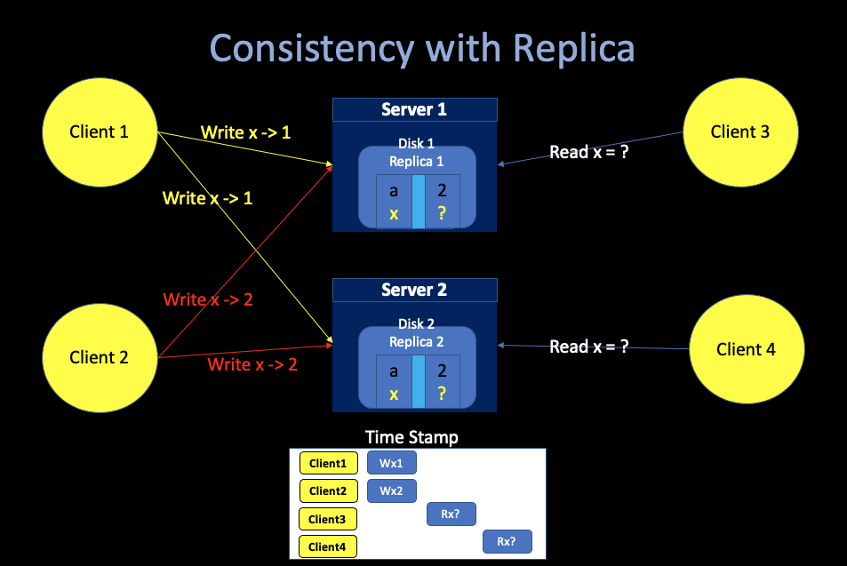

# 3. Google File Systems
##### 02/22/2022 By Angold Wang

## 1. Distributed Storage

### i. Why do we need distributed storage?

* **We want to store more data**
    * store data across multiple servers
* **We want high performance (throughput)**
    * split the request data into pieces and read them concurrently from different servers.
    * **the mapreduce example**: 
        * The throughput of single SSD is **`10MB/s`**.
        * If we split the big data set into **`1000`** servers.
        * We can achieve **`10000MB/s`** throughput by reading from 1000 disks concurrently.

### ii. Conumndrum of High-Performance
* **we want high performance** => **shared data over many servers**
* **many servers** => **constant faults (some machines are gonna crash)**
* **fault tolerance** => **replication**
* **replication** => **potential inconsistencies**
* **better consistency** => **low performance**

### iii. Consistency

#### Strong Consistency

* **Suppose Client1 and Client2 write concurrently.**
* **After the writes have completed, Client3 and Client4 read. What can they see?**

**Answer: either 1 or 2, but both have to see the same value. This is a "strong" concurrency model.**

#### In a distributed system ...
**Replication for fault-tolerance makes strong consistency tricky.**

* **Client1 and Client2 send writes to both, in parallel**

**This time, both Client3 and Client4 will also see either 1 or 2, but no guarrentee that they will see the same value. That is not a strong consistency.**

**Better consistency ususlly requires communication to ensure the replicas stay in sync, which can be slow. And there are lots of tradeoffs possible between performance and consistency.**

