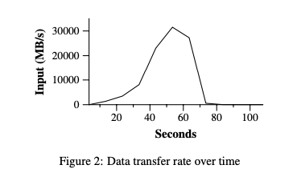
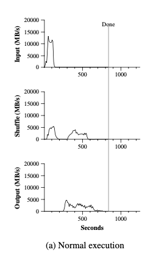

# MapReduce Notes

**By [Angold Wang](https://github.com/Angold-4) | [Original Paper](mapreduce.pdf)**


## 1. Introduction
Back to 2004, engineers in Google have implemented hundreds of special-purpose computations that process large amounts of raw data. Such as building a index of the web, and handle crawled documents, web requests logs, etc.<br>
**However, the input data is usually large and the computations have to be distributed across hundreds or thousands of machines in order to finish in a reasonable amount of time.**<br> 
**How to parallelize the computation, distribute the data, and handle failures**, soon becames a big question.<br>

So they really needed some **kind of framework** that would make it easy to just have their engineers write the kind of guts of whatever analysis they wanted to do, like sort algorithm or a web index or link analyzer or whatever. <br>
**Just write the guts of that application and be able to run it on a thousands of computers without worrying about the details of how to spread the work over the thousands of computers how to organize whatever data movement was required, or how to cope with the inevitable failures.**

#### In short, they were looking for a framework that would make it easy for non-specialists to be able to write and run giant distributed computations.

* Multi-hour Computations
* Multi-terabyte Datasets

## 2. Programming Model

**In a programmer's view, the computation recieves many files, and takes a set of input key/value pairs, then produces a set of output key/value pairs.**

### Example: word count


#### Abstract view of a MapReduce job:

#### Map
* Written by the User.
* Recieve input files and then produces a set of output key/value pairs.
* MR calls `map(k, v)` for each input file `k`, and its contains `v`, produces set of `k2`, `v2` " intermediate" data.
```javascript
map(String key, String value) {
    // key: document name
    // value: document contents
    for each word w in value:
        Emit(w, "1");
}
```


#### Reduce
* Wirtten by the user.
* Recieve key/value pairs from **`Map`**.
* Then merge together these values with same key to **form a possibly smaller set of values**.
* MR gathers all intermediate `v2` for a given `k2`, and passes each key + values to a reduce call.
* Final outut is set of <k2, v3> pairs from `reduce(k2, v2)`s.
```javascript
reduce(k, v)
    // key: a word
    // value: a list of counts
    int result = 0; 
    for each v in values:
        result += ParseInt(v);
    Emit(AsString(result));
```
```javascript
// or in this way:
reduce(k, v)
    emit(len(v));
```

#### MapReduce scales well
* N "worker" computers get you Nx throughtput.
* `map`s can run in parallel, since they don't interact. Same for `reduce`s.
* In that way, you can get more throughtput by buying more computers.


## 3. Implementation Details


### 1. Runtime Details (paper's Figure 1):
1. **The input and output are stored on a cluster file system called GFS (Google File System), where the part of MapReduce library splites files over many servers, in typically 16MB to 64MB piece. It then starts up many copies of the prgram on a cluster of machines.** 

2. **One of the copies of the program is special -> the master, the rest are workers that are assigned work by the master. Let's say there are M map tasks and R reduce tasks to assign. The master pick idle workers and assigns each one a map task or a reduce task.**

3. **Master gives Map tasks to workers until all `map()`s complete. A worker who is assigned a map task reads the contents of the corresponding input split, and then write output (intermediate data) to local disk.**

4. **Periodically, the intermediate data pairs are written to local disk of each Map workers (in region groups), and the locations of each worker's disk group are passed back to the master, who is responsible for forwarding these locations to the Reduce**

5. **After all Mapes have finished, master hands out Reduce tasks, when a Reduce workers is notified by the master about these locations (different regions), it read the data from disk from map workers. When a Reduce worker has read all intermediate datam it sorts it by the intermediate keys so that all occurrences of the same keys are grouped together**.

6. **The reduce worker iterates over the sorted intermediate data and for each unique intermediate key encounted, it passes the key and the corresponding set of intermediate values to the user's Reduce function, and write the output file on GFS.**

**Finally, when all map tasks and reduce tasks have been compeleted, the master wakes up the user program. At this point, the MapReduce call in the user program returns back to the user code.**

### 2. Fault Tolerance

Since the MapReduce library is designed to help process very large amounts of data using hundreds or thousands of machines, the library must tolerate machine failures gracefullly. (Must insert fault tolerance into its design)


The master keeps several data structures.<br>
**For each map task and reduce task. it stores the state (idle, in-progress, or completed), and the identity of the worker machine.**

#### Worker Failure

##### We want to completely hide failures from the application programmer.

**The master pings every worker periodically. If no response is recieived from a worker in a certain amount of time, the master marks the worker as failed. MR re-runs just the failed `map`s and `reduce`s.**

#### Details of worker crash recovery

#### Map worker crashes:
* **Master notices worker no longer responds to pings.**
* **Master knows which map tasks it ran on the worker, since their output is stored on the failed machine and is there inaccessible by other Reduce workers (no write location back to the master), and the output must be re-executed.**
* **Then Master schedule another worker to run those failed tasks**
* **If some `reduce`s already fetched the intermediate data (if this `map` is already finished), the `reduce` need to be re-running**

#### Reduce worker crashes:
* **Master re-starts worker's unfinished tasks on other workers.**


#### Master Failure
* **During the runtime of Master, the master program will write periodic checkpoints to the master data structures.**
* **If the master task dies, a new copy can be started fromm the last checkpointed state.**


### 3. Locality

##### What will likely limit the performance of MapReduce?
**In 2004, authors were limited by network capacity, the paper's root switch: 100 to 200 gigabits/second, total 1800 machines, so 55 megabits/second/machine. which is relatively small (e.g. much less than disk or RAM speed)**

##### How MR minimize network use?
* **Master tries to run each Map task on GFS Server where stores its input. (i.e. all computers run both GFS and MR workers) so input is read from local disk, not over network.**
* **Intermediate data goes over network just once. which from Map workers' local disk -> Reduce workers, rather than using GFS.**


### 4. Task Granularity

##### How does MR get good load balance?

**Wasteful and slow if N-1 servers have to wait for 1 slow server to finish. But the fact is that some tasks likely take longer than others.**<br>

**We subdivide the map phase into M pieces and the reduce phase into R pieces. Ideally, M and R should be much larger than the number of worker machines. (i.e. many more tasks than workers).<br>**

**Master hands out new tasks to workers who finish previous tasks, so "faster" servers do more than "slower" ones, finish about the same time(hopefully), which improves dynamic load balancing.**<br>

But there are also some limitations of how large M and R can be, some kind of "trade-off", since the Master must make `O(M + R)` scheduling decisions.<br>
In practice, we often perform MapReduce computations with M = 200,000 and R = 5,000 using 2,000 worker machines.


### 5. Backup Tasks

**One of the common causes that lengthens the total time taken for a MapReduce operation is a "straggler": a machine that takses an unusually long time to complete its works.**<br>

**Which means, a machine can compelete its works, but costs too much times than other machine doing the same job. The reason of that is usually some correctable errors that slow its performance, like disk problem, or the competition for CPU, memory, network bandwidth.**<br>

**The engineers in Google have a general mechanism to alleviate the problem of stragglers: When a MapReduce operation is close to completion, the Master schedules backup executions of the remaining** *in-progress* **tasks. The task is marked as completed whenever either the primary of the backup execution completions.**


## 4. Practice Performance
**I am not going to list the Refinements mentioned in the [original paper](mapreduce.pdf), In the last part of this note, I would like to bring some of my own throughts and understandings.**<br>

**In this part, I am going to return to the practice from those theories mentioned above.**<br>
First, let me introduce the configuration of cluster, which is also listed in the paper:<br>

* All of the programs were executed on a cluser that consisted of approximately 1800 machines.
* Each machine has two 2GHz Intel Xeon processors, 4GB of memory, two 160GB IDE disks.
* All of the machines were in the same hosting facility.


### 1. Grep

**[Grep](https://en.wikipedia.org/wiki/Grep) is a program for searching plain-text data sets for lines that match a regular expression.**<br>

Let's say, in this scenario, the *grep* program scans through 10^10 100 byte (0.96 TB) records. Searching for a relatively rare three-character pattern (the pattern occurs in 92,337 records).<br>

We split the input into apporximately 64MB pieces (M = 15000), and the entire output is placed in one file (R = 1).

**Figure 2 shows the progress of the computation over time.**



#### A Classic MapReduce Process:

1. **At the very first 1 minute (didn't show in the figure), there is a overhead due to the propagation of the program to all worker machines, and delays interacting with GFS to open the set of 1000 input files and to get the information needed for the locality optimization.**

2. **The Y-axis which is the data transfer rate gradually picks up as more machines are assigned to this MapReduce computation. And peaks at over 30GB/s.**

3. **As map tasks finish, the rate starts dropping and hits zero about 80 seconds into the computation.**

**So, It takes about 150 seconds to finish all the Grep tasks**


### 2. Sort

**The Sort program sorts approximately 1 terabyte of data.**<br>
**You may wonder what sorting algorithm does google use in MapReduce:**<br>

#### 1. TeraSort
> **[TeraSort](TeraByteSort.pdf) is a standard MapReduce sort.** <br>In particular, the partitioner (uses trie) and Map workers will send all keys such that `sample[i-1] <= key < sample[i]` to Reduce worker i. Which will guarentee that the sorted output of Reduce worker i are all less than the output of Reduce worker i+1. And the Reduce workers will sort all keys that were sent to them.

#### 2. MergeSort
> **MergeSort** is the default way of sorting in MapReduce.<br> Each Map workers sort its own piece of data (divide) and the Reduce workers merge them.

In this particular example, we use **TeraSort** as our algorithm.




**The top graph of Figure (a) shows the rate at which input is read, as we can see, the rate peaks at about 13GB/s, and then all Map tasks finished before 200 seconds have elapsed.**<br>

There are two things in the graph need to be mentioned:
1. **Note that the input rate is lesss than for *grep*, that is because the sort map tasks spend about half their time and I/O bandwidth writing intermediate output to their local disks. (Just number counts in *grep*)**

2. **For the following figure, the graph on the right is the TeraSort in MapReduce without [Backup Tasks](### 5.Backup Tasks) that we mentioned before.<br>As we can see that, there are two peaks on the left graph and only one on the right, that is at the end the of all Map tasks, there will be some Backup Tasks that assigned by the Master to other already-finished (free) workers, to help avoid the "straggler" problem which we mentioned above.**<br>


As expected, the finish time of MapReduce with backup tasks enabled finished about 960 seconds, which is about 44% faster than the backup tasks disabled MapReduce tasks.

**The middle graph of Figure (a) shows the rate at which data is sent over the nework from the map tasks to the reduce tasks.**<br>


The shuffling starts as soons as the first map task completes. Since the number of map tasks is much larger than reduce tasks, the first hump in the graph is for the first batch of approximately 1800 reduce tasks, then after this first batch fiinshed, which costs about 300 seconds, **then these Reduce workers write their sorted data to the final output files files by the reduce tasks. As we can see in the bottom graph.**<br>

There are also a few things to note:<br>

1. **The input rate is higher than the shuffle rate and output rate, that is because the [locality optimization](### 3. Locality), where most data is read from a local disk.**

2. **The shuffle rate is higher than the output rate because the output phase writes two copies of the sorted data. (replicas of the output for the reliability) The copy algorithm in the files system is slower than erasure operations.**


